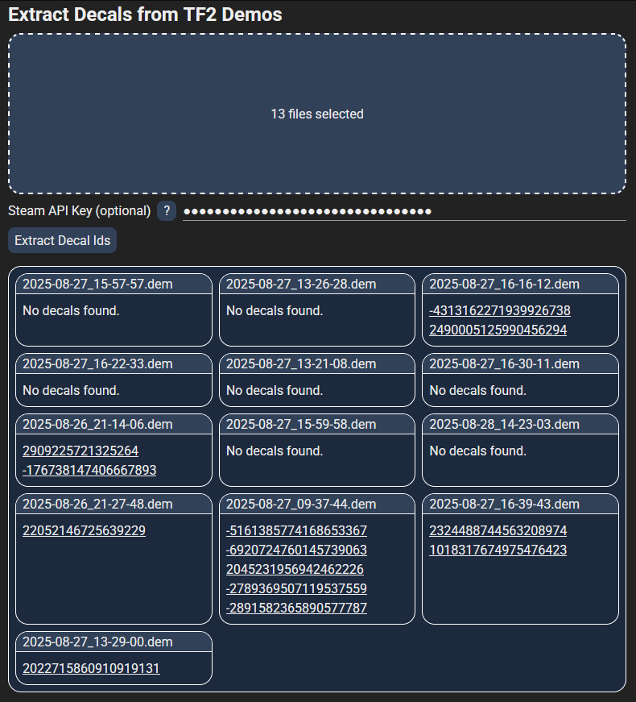

# TF2 Decals From Demos

A simple tool to extract the ids of decals (custom images on things such as conscientious objectors) from demos. The tool can be used at https://thelazysquid.github.io/tf-decals-from-demos.

## Limitations

Decals only include the ids of decals, rather than the decal image itself. In order to get the image the Steam API needs to be used, which is impossible in the browser due to CORS limitations. If you enter your Steam API key this tool will link to the relevant API endpoint for each decal, which will include the link to the image on the decal.

Additionally, decals on items that you have equipped will not be recognized.